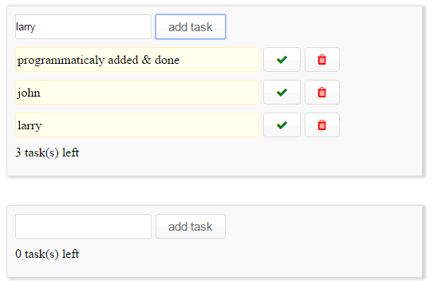

The  simple todolist web component only supported by chrome as we do not include any polyfill. 



Example of code from host html page.


```html
 <mo-todolist id='todolist1'></mo-todolist>
 
 <mo-todolist id='todolist2'></mo-todolist>
 
 <script type='text/javascript'>
 	var tdl = document.querySelector('#todolist1');
 	
     tdl.init(
 		{
 			onTaskAdded : callbackTaskAdded
 		});

     tdl.addTask({
         description : 'programmaticaly added',
         status : 'todo'
     });

     tdl.addTask({
         description : 'programmaticaly added & done',
         status : 'done'
     });
 </script>
```
